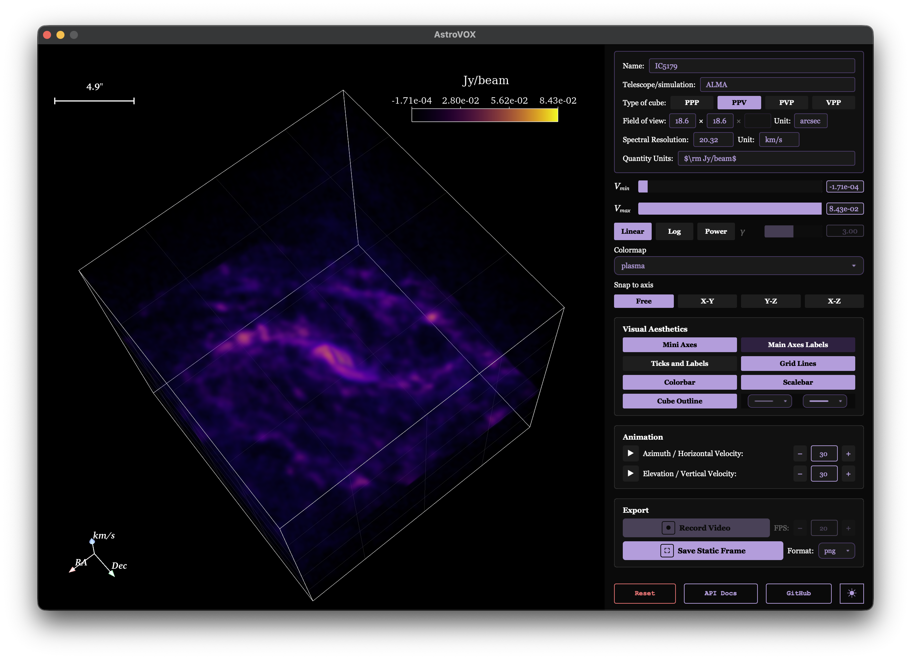
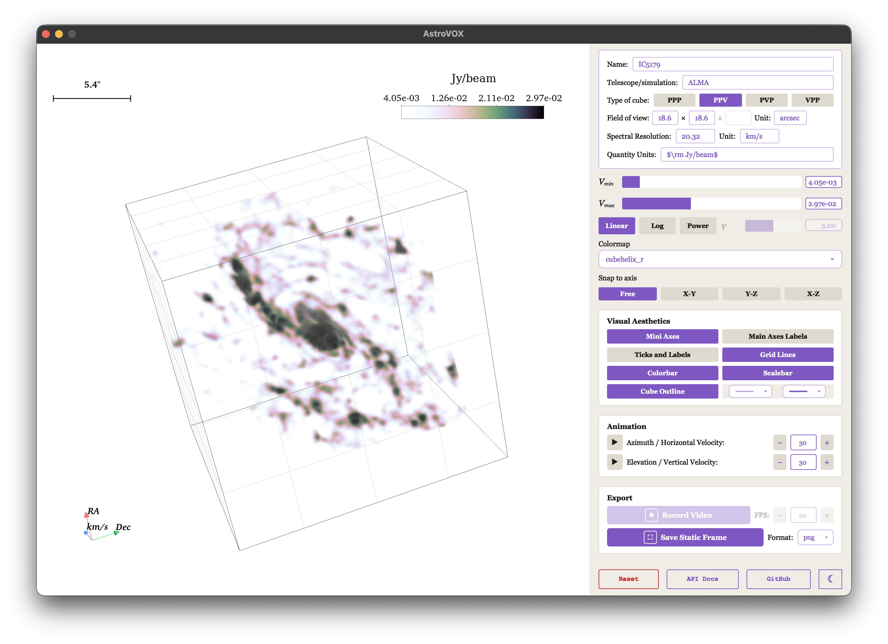
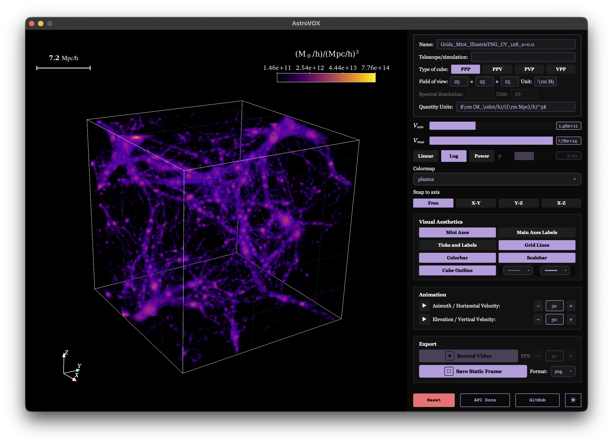
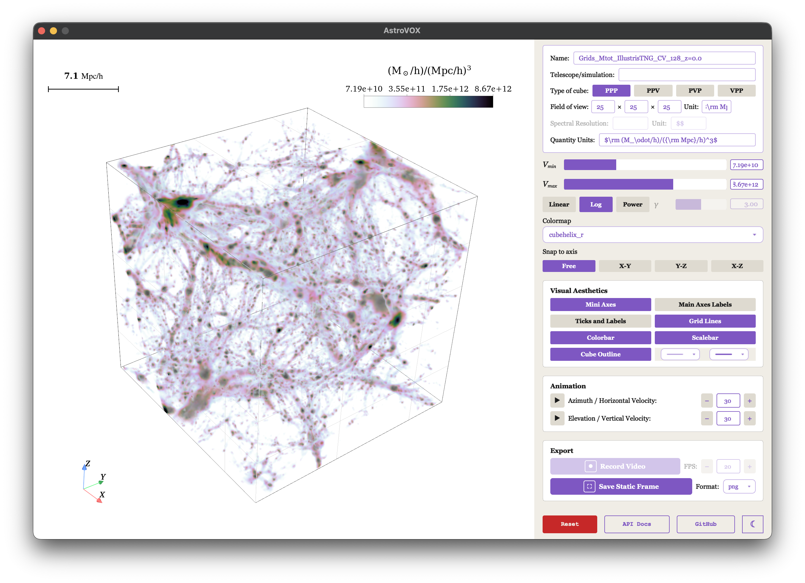

<p align="center">
  
</p>

<p align="center">
  <a href="https://github.com/arnablahiry/AstroVOX/actions/workflows/tests.yml"></a>
  
  <a href="LICENSE"></a>
</p>

<p align="center">
  A GUI for visualizing astrophysical and cosmological 3D data cubes — spatial (PPP) cubes and position-position-velocity (PPV) cubes alike — powered by <a href="https://pyvista.org/">PyVista</a>.
</p>

---

## Overview

**AstroVOX** is a desktop visualization application for volumetric data cubes commonly encountered in astronomy and astrophysics: interferometric and single-dish spectral-line cubes (e.g. HI, CO), integral-field spectroscopy data, and simulated cosmological/hydrodynamical volumes (e.g. CAMELS, IllustrisTNG). It renders the cube as an interactive, GPU-accelerated 3D volume built on [PyVista](https://pyvista.org/) and [VTK](https://vtk.org/), wrapped in a control panel purpose-built for cube inspection rather than general-purpose plotting.

Any cube axis ordering is supported and labelled accordingly:

- **PPP** — position–position–position, e.g. a spatial density field from a simulation snapshot.
- **PPV / PVP / VPP** — position–position–velocity cubes (and axis permutations thereof), the standard layout for spectral-line radio/mm-wave and IFU data.

## Supported formats

- **FITS** (`.fits`, `.fit`, `.fts`) and **HDF5** (`.h5`, `.hdf5`) — AstroVOX reads basic metadata directly from the file (header/attrs, WCS, intensity units) and pre-fills the cube info fields for you.
- **NumPy arrays** (`.npy`, `.npz`) — a bare 3D array carries no physical metadata, so AstroVOX lets you fill in what's needed for scientifically meaningful rendering: units, field of view, spectral resolution, and quantity/intensity units.

## Features

**Cube metadata** — name, telescope/simulation origin, cube type (PPP/PPV/PVP/VPP), field of view with physical unit, spectral resolution with unit, and quantity/intensity units, all shown alongside the render.

**Transfer function controls** — independent Vmin/Vmax range sliders, and Linear, Log, or Power (with adjustable gamma) scaling of the volume's colour and opacity mapping, plus a colormap selector.

**Camera & orientation** — free rotation, or snap the view to a fixed X-Y, Y-Z, or X-Z plane.

**Visual aesthetics toggles** — mini orientation axes, main axes labels, tick marks and tick labels, grid lines, colourbar, scale bar, and cube outline (with selectable line style and thickness).

**Animation** — independent azimuth (horizontal) and elevation (vertical) auto-rotation, each with its own play/stop control and adjustable angular velocity.

**Export** — record a rotating fly-around to video at a chosen frame rate, or save the current view as a static frame in your preferred image format.

**Light/dark theme** toggle, and a one-click reset back to defaults.

<p align="center">
  <br>
  
</p>
<p align="center"><em>A PPV spectral-line cube of the ALMA-observed IC5179 galaxy FITS file in dark and light theme.</em></p>

<p align="center">
  <br>
  
</p>
<p align="center"><em>A PPP cosmological simulation volume NumPy array in dark and light theme - CAMELS Multifield Dataset IllustrisTNG Suite, total matter ensity grid.</em></p>

## Installation

Requires Python 3.9+.

```bash
pip install .
```

For an editable development install:

```bash
pip install -e .
```

To also run the test suite:

```bash
pip install -e ".[test]"
pytest
```

## Usage

Launch the application:

```bash
astrovox
```

To launch straight into a cube instead of starting on the drop-zone landing page, pass its path:

```bash
astrovox <path_to_cube>
```

Open a FITS, HDF5, or NumPy cube from the file picker. For FITS/HDF5 files, AstroVOX pre-fills the cube info fields from the file's own metadata; for a bare NumPy array, fill in the cube type, field of view, spectral resolution, and quantity units yourself so the render is on a physically meaningful scale. Then use the side panel to adjust the transfer function, camera, and visual aesthetics before exporting a video or still frame.

## Requirements

- [PyVista](https://pyvista.org/) & VTK — 3D volume rendering
- [Astropy](https://www.astropy.org/) — FITS I/O and WCS handling
- NumPy
- imageio / imageio-ffmpeg — video export

## License

Released under the [MIT License](LICENSE).
